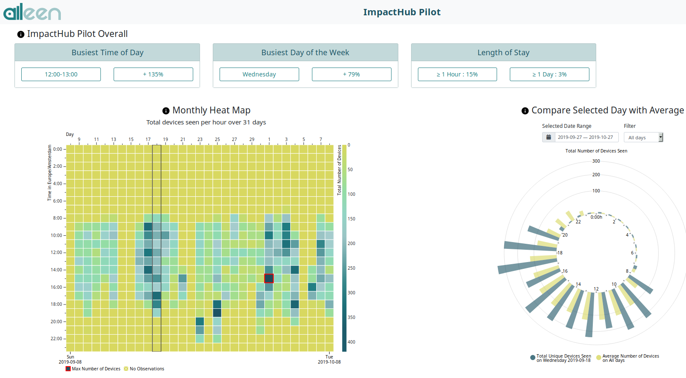

# Aileen

Aileen, a hardware/software suite designed for NGOs, counts signals from devices with a wireless interface enabled (such as smartphones) to deliver population data in an organized and actionable format.



## Hardware

We used this:

- ALFA AWUS036NH HIGH POWER WIFI USB-ADAPTER
- Computer running Ubuntu 18.04 LTS

## Dependencies

- Make a virtual environment, e.g.: `virtualenv env_aileen`
- Activate it, e.g: `source env_aileen/bin/activate`
- Install the `aileen` dependencies:
  `python setup.py develop`
   # TODO: how to separate?
- If you want to collaborate on code, please install pre-commit for it to hook into commits:
  `pre-commit install`
- TODO: Maybe run installation script? 

## Database for development

Use sqlite

## code

- We use black for code formatting.
- We use isort for package importing.

## .env file

To run the aileen box you should have at least the following in an `aileen/.env` file. See settings.py for more configuration.
(You can also use env vars directly)

```
WIFI_INTERFACES='theWifiInterfaceOfDevice'
DISABLE_AUTO_TITLE='true'
```

Aileen-wifi will tell you about the wifi interfaces it sees if you don't know what to put for the first setting.


## First migrations and superuser

Initialize the database

- `python manage.py makemigrations`
- `python manage.py migrate`

Create a super user

- `python manage.py createsuperuser`

## Test app

Check if everything was installed correctly with either:

- `python manage.py runserver`
- `python manage.py run_box`

## Restarting

The wifi card is being set into monitor mode. To restart the box, these steps might be necessary:

* python manage.py stop_box
* sudo /path/to/airmon-ng stop wlan0mon
* python manage.py start_box

## Data to map on server

Go to the `/admin` url and add a location for the aileen box

## Deploy server app

When creating an app on a server be sure to tell the server to collect the static files with the following
`python manage.py collectstatic`
